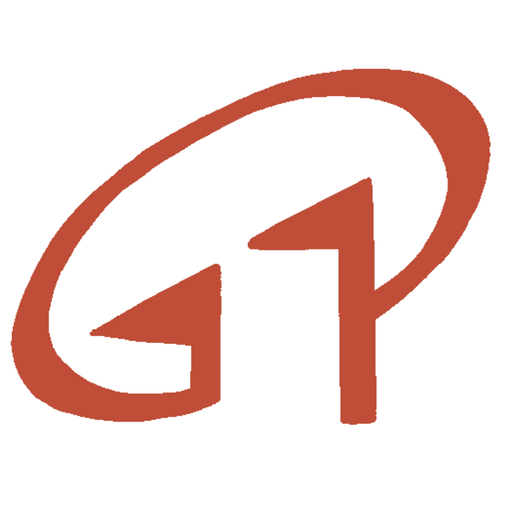

# 機零壹科技 (G01 Technologies) 官方網站重構專案



這是 **機零壹科技股份有限公司 (G01 TECHNOLOGIES INC.)** 的官方網站重構專案。本專案將傳統靜態頁面升級為現代化、高性能且具備豐富動態效果的工業級企業官網。

## 🏢 關於機零壹科技
機零壹科技成立於 1991 年，擁有超過 30 年的精密加工經驗，專注於：
- **光學級導光板、擴散板**：高品質顯示器級組件解決方案。
- **精密 CNC 加工**：PMMA (壓克力)、PC 等光學級材料的高精度裁切與鑽孔。
- **自動化生產**：擁有 2500 坪廠房與自動 CNC 生產線，支援達 110 吋的巨型加工能力。

## ✨ 網站特點
- **專業視覺設計**：採用工業深藍主色調搭配技術點陣紋理背景，展現嚴謹的工藝氣質。
- **絲滑動畫效果**：內容隨捲動流暢浮現，並配備自動圖片輪播展示加工實力。
- **跨平台完全適配**：針對手機與平板電腦進行深度排版優化，確保在行動裝置上的極致閱讀體驗。
- **極速效能**：純靜態 HTML5/CSS3 架構，零外部框架依賴，實現秒開載入。

## 🛠️ 技術規格
- **字體組合**：Source Sans 3 (英) + Noto Sans TC (中)。
- **色彩規範**：品牌藍 (#004a99) / 鋼鐵灰 (#334155) / 點綴紅 (#e74c3c)。
- **認證標準**：符合 ISO 9001:2015 品質管理體系展示。

## 📁 檔案結構
```text
├── index.html          # 首頁 (核心優勢與輪播展示)
├── about.html          # 關於機零壹 (時間軸沿革與公司簡介)
├── products.html       # 產品與生產線 (加工規格與生產藝廊)
├── GEMINI.md           # 內部開發規範與版本更新記錄
└── assets/
    ├── style.css       # 響應式、動畫與材質感樣式定義
    └── images/         # 已全面優化為英文檔名的圖片資產
```

---
© 2026 機零壹科技股份有限公司 G01 TECHNOLOGIES INC. All Rights Reserved.
