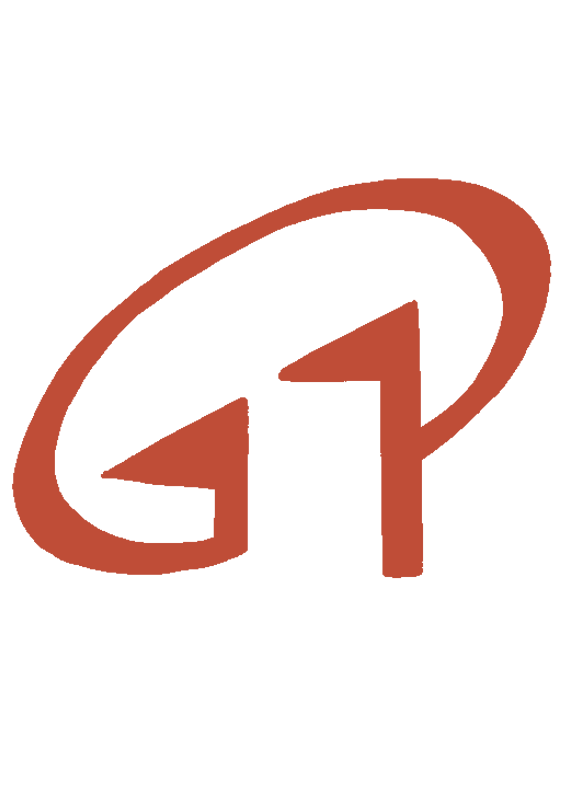

# 機零壹科技 (G01 Technologies) 官方網站重構專案



這是 **機零壹科技股份有限公司 (G01 TECHNOLOGIES INC.)** 的官方網站重構專案。本專案旨在將原先由 Google Sites 導出的混亂靜態網頁，轉化為現代化、響應式且高效能的 HTML5/CSS3 網站。

## 🏢 關於機零壹科技
機零壹科技成立於 1991 年，擁有超過 30 年的精密加工經驗，是台灣領先的塑膠加工企業。我們深耕於：
- **光學級導光板 (LGP)**：提供電視、顯示器等級的高透光率組件。
- **精密 CNC 加工**：專注於 PMMA (壓克力)、PC 等材料的高精度切割與鑽孔。
- **一站式服務**：從材料採購、精密切割到 ISO 認證的品質檢測。

## 🎯 專案目標
- **專業化改造**：徹底移除過時的防疫隔板內容，回歸「精密加工」與「導光板」核心業務。
- **效能優化**：拋棄 Google Sites 冗餘的 JavaScript 與內聯樣式，改用純淨的語義化 HTML。
- **視覺升級**：採用專業工業風配色（專業藍/工業灰），並支援行動裝置響應式佈局 (RWD)。
- **架構標準化**：統一管理資產路徑，提升維護效率。

## 🛠️ 技術規格
- **前端語法**：HTML5, Vanilla CSS3 (無使用外部框架以保持極輕量)。
- **設計風格**：簡約工業風、卡片式佈局、SVG 圖標整合。
- **認證標準**：符合 ISO 9001:2015 品質管理體系。

## 📁 檔案結構
```text
C:\Users\open1\Desktop\My side project\g01_website
├── index.html          # 首頁 (核心優勢與設備展示)
├── about.html          # 關於機零壹 (發展沿革與經營理念)
├── products.html       # 產品與生產線 (加工規格與 ISO 認證)
├── GEMINI.md           # 內部開發規範與更新記錄
└── assets/
    ├── style.css       # 全站統一式樣表
    └── images/         # 產品圖、產線照與 Logo 資產
```

## 🚀 如何預覽
由於本專案為純靜態網站，您可以直接在瀏覽器中開啟 `index.html` 進行預覽，或使用 VS Code 的 `Live Server` 擴充功能進行本地開發與實時檢視。

---
© 2026 機零壹科技股份有限公司 G01 TECHNOLOGIES INC. All Rights Reserved.
