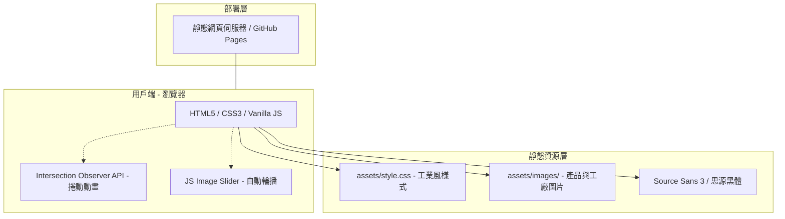
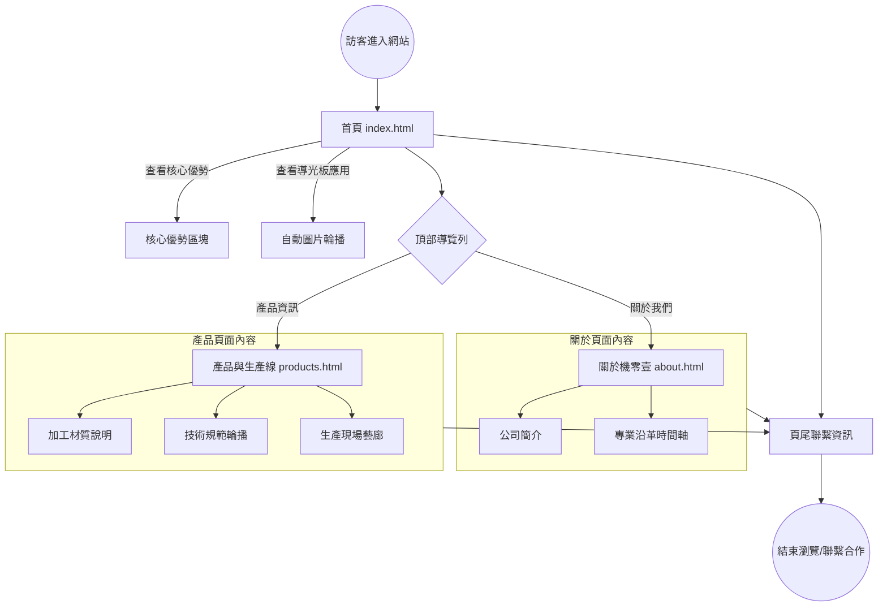

# 機零壹科技網站架構與流程圖

本文件使用 Mermaid 語法描述機零壹科技 (G01 Website) 的系統架構與使用者操作流程。

## 1. 系統架構圖 (System Architecture)
描述網站的組成元件與技術層次。

## 2. 使用者流程圖 (User Flow)
描述訪客進入網站後的導覽行為與互動。

## 3. 技術規格摘要
- **前端技術**：HTML5, CSS3, Vanilla JavaScript (無外部 Framework 依賴)。
- **字體設計**：Source Sans 3 (英) + Noto Sans TC (中)。
- **動態效果**：
    - 使用 `Intersection Observer` 實現元素捲動浮現 (Reveal effect)。
    - 使用 `CSS Keyframes` 搭配 JS 控制圖片淡入淡出輪播。
- **響應式設計**：針對 Mobile 進行 Media Query 優化，修復背景與導航列排版。
