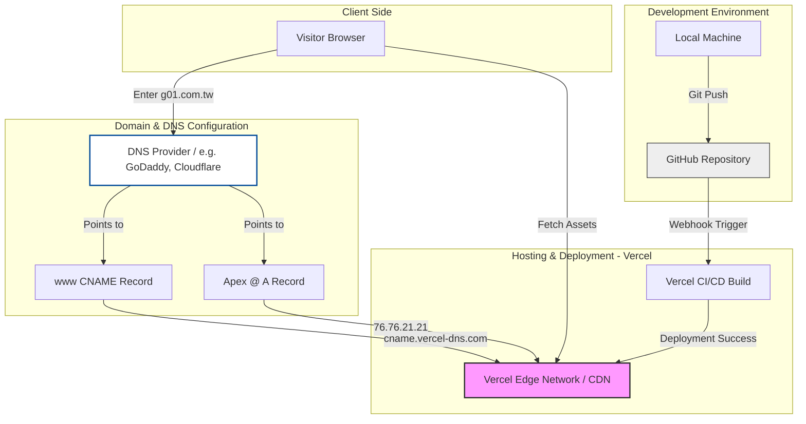
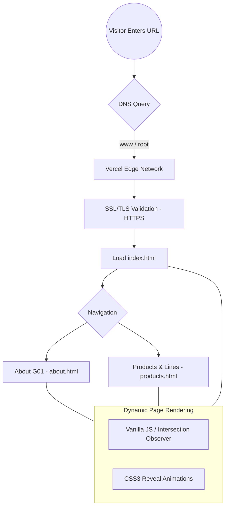

# G01 Website: Technical Architecture & Deployment Flow

This document describes the infrastructure architecture, automated deployment process, and Domain Name System (DNS) configuration for the G01 Website.

## 1. Infrastructure & Deployment Architecture
Describes the end-to-end path from local development to Vercel hosting and custom domain mapping.

## 2. Domain Migration & Configuration Guide

Follow these steps to point your custom domain from your provider to Vercel:

### Step 1: Add Domain in Vercel
1. Navigate to **Vercel Dashboard** -> Select your Project.
2. Go to **Settings** -> **Domains**.
3. Enter your domain (e.g., `www.g01.com.tw`) and click **Add**.

### Step 2: Configure DNS Records
Log in to your domain registrar (e.g., GoDaddy, Namecheap) and add the following records:

| Type | Name | Value / Alias | Description |
| :--- | :--- | :--- | :--- |
| **CNAME** | `www` | `cname.vercel-dns.com` | Maps the 'www' subdomain to Vercel |
| **A** | `@` | `76.76.21.21` | Maps the Apex domain (root) to Vercel IP |

### Step 3: DNS Propagation
- It usually takes 10 minutes to several hours for the DNS changes to propagate globally.
- Vercel will automatically provision and renew your **SSL Certificate (HTTPS)** once the records are verified.

## 3. User Flow Diagram

## 4. Technical Specifications Summary
- **Source Control**: GitHub (Private/Public Repository).
- **Deployment Strategy**: Vercel CI/CD (Automated builds triggered by Git Push).
- **Domain Mapping**: CNAME (www) + A Record (@) targeting Vercel Anycast IP.
- **Performance & Security**: Vercel Global Edge Network (CDN) with automated SSL via Let's Encrypt.
