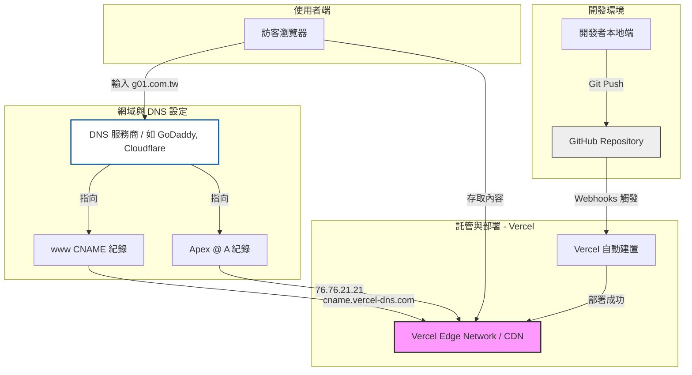
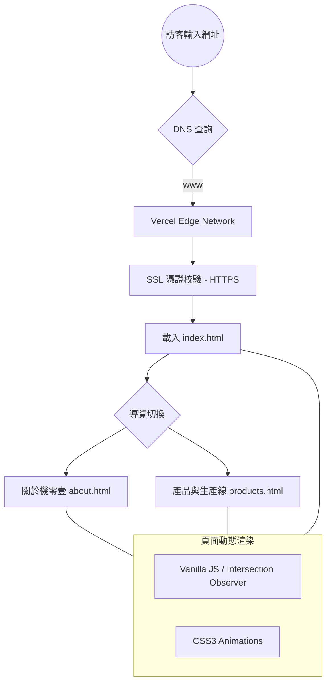

# 機零壹科技網站：技術架構與部署流程

本文件描述機零壹科技網站的基礎設施架構、自動化部署流程以及網域 (DNS) 設定。

## 1. 基礎設施與部署架構 (Infrastructure & Deployment)
描述從開發到網域指向 Vercel 的完整路徑。

## 2. 網域遷移與設定步驟 (Domain Migration Guide)

如果您要將網域從其他地方遷過來並指向 Vercel，請依照以下步驟設定：

### 第一步：在 Vercel 專案中新增網域
1. 進入 Vercel Dashboard -> 選擇您的專案。
2. 點擊 **Settings** -> **Domains**。
3. 輸入您的網域 (例如 `www.g01.com.tw`) 並點擊 Add。

### 第二步：前往 DNS 服務商進行設定
登入您的網域註冊商 (如 GoDaddy, Hinet, Cloudflare)，找到 DNS 管理介面並新增以下紀錄：

| 類型 (Type) | 主機紀錄 (Name) | 指向地址 (Value / Alias) | 說明 |
| :--- | :--- | :--- | :--- |
| **CNAME** | `www` | `cname.vercel-dns.com` | 將子網域 www 指向 Vercel |
| **A** | `@` | `76.76.21.21` | 將主網域 (Apex) 指向 Vercel IP |

### 第三步：等待生效 (DNS Propagation)
- 修改後大約需要 10 分鐘到幾小時不等的時間生效。
- Vercel 會自動為您申請並更新 **SSL 憑證 (HTTPS)**。

## 3. 使用者瀏覽流程 (User Flow)

## 4. 技術規格摘要
- **原始碼託管**：GitHub (Private/Public Repo)。
- **自動化部署**：Vercel CI/CD (偵測 Git Push 自動更新)。
- **網域指向**：CNAME (www) + A Record (@)。
- **加速與安全**：Vercel Global Edge Network + 自動 HTTPS (Let's Encrypt)。
